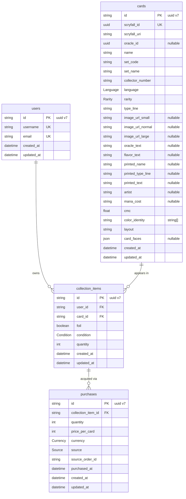

# Entity-Relationship Diagram

ER diagram for the MTG collection database, generated from [prisma/schema.prisma](../prisma/schema.prisma).

Table and column names below reflect the physical database names (`@map` / `@@map`), i.e. snake_case.

## Relationships

- A **users** row owns many **collection_items** (one per unique card/foil/condition combination).
- A **cards** row (a specific printing) appears in many **collection_items**.
- A **collection_items** row has many **purchases** tracking how the copies were acquired.

## Unique constraints

- **users**: `username`, `email`
- **cards**: `scryfall_id`; composite `(set_code, collector_number, language)` — one row per printing per language
- **collection_items**: composite `(user_id, card_id, foil, condition)` — one row per distinct condition/finish a user owns

## Enums

| Enum        | Values |
|-------------|--------|
| `Rarity`    | COMMON, UNCOMMON, RARE, SPECIAL, MYTHIC, BONUS |
| `Condition` | MINT, NEAR_MINT, EXCELLENT, GOOD, LIGHT_PLAYED, PLAYED, POOR |
| `Language`  | EN, ES, FR, DE, IT, PT, JA, KO, RU, ZHS, ZHT, HE, LA, GRC, AR, SA, PH |
| `Currency`  | EUR |
| `Source`    | CARDTRADER, DIRECT_PURCHASE, TRADE, GIFT, OTHER |
